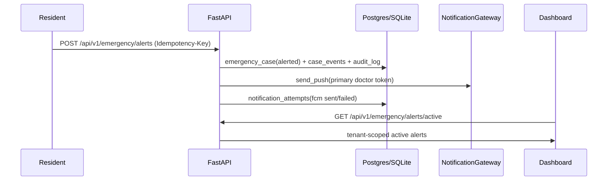

# Architecture

> Living document — updated every slice. Authoritative scope/decisions: `../PLAN.md`.

## Components (target)

- **apps/backend** — FastAPI (Python 3.11+), SQLModel/SQLAlchemy 2.x, Alembic.
  Owns all APIs, RBAC, audit log, notification fan-out, PDF generation.
- **apps/dashboard** — React (Vite) + TS + TanStack Query + shadcn/ui (doctor +
  admin; nurse uses doctor dashboard with reduced permissions for MVP).
- **apps/mobile** — Flutter resident app.
- **packages/shared-types** — canonical enums + OpenAPI-generated TS types.

## Provider abstraction

`NotificationGateway` (push/SMS/voice) and `StorageGateway` (S3) selected by
`PROVIDER_MODE=stub|live`. Business logic depends only on the interfaces. Fan-out
fires push + SMS + voice in parallel; each logs independently to
`notification_attempts`; one failing never blocks the others.

## Emergency data flow

Slice 5 local happy path:

Slice 6 extends this to parallel SMS + voice, on-call schedules, backup
escalation, mobile offline retry, and fallback dialing.

_Status: filled through Slice 5._
